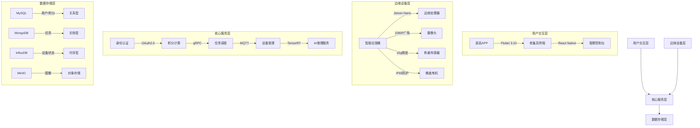
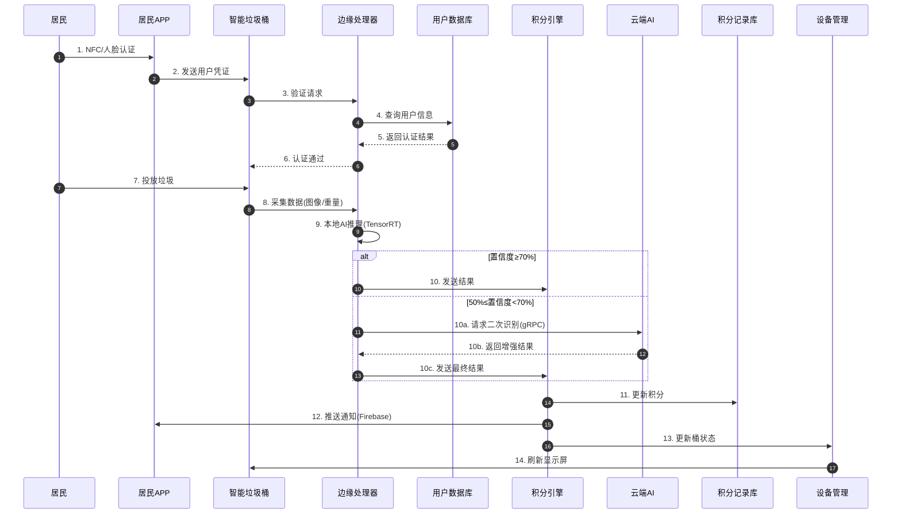
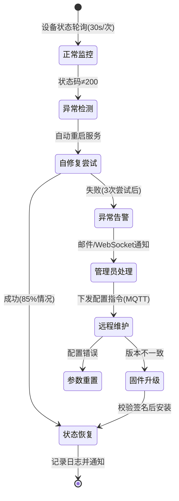
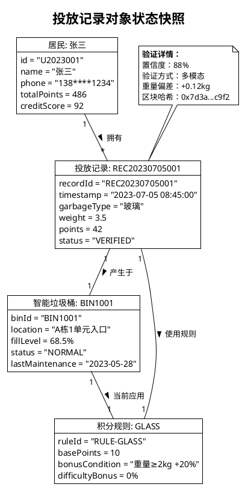

<div align="center">
  <h1>🎯 EcoSorter - 智能垃圾分类督导系统</h1>
  
  <p>
    <em>基于 AI图像识别 + 边缘计算 + 多端协同的智能环保解决方案</em>
  </p>

  <div>
    <a href="https://github.com/YangShengzhou03/EcoSorter/stargazers">
      
    </a>
    <a href="https://github.com/YangShengzhou03/EcoSorter/forks">
      
    </a>
    <a href="https://opensource.org/licenses/MIT">
      
    </a>
    <a href="https://github.com/YangShengzhou03/EcoSorter/issues">
      
    </a>
    <a href="https://github.com/YangShengzhou03/EcoSorter/pulls">
      
    </a>
  </div>

  <div>
    <a href="https://kotlinlang.org/">
      
    </a>
    <a href="https://react.dev/">
      
    </a>
    <a href="https://nestjs.com/">
      
    </a>
    <a href="https://www.postgresql.org/">
      
    </a>
  </div>

  <br />
  
  [](https://star-history.com/#YangShengzhou03/EcoSorter&Date)

</div>

## 🌍 目录导航
- [✨ 项目简介](#-项目简介)
- [🚀 核心功能](#-核心功能与亮点)
- [🏗️ 系统架构](#-系统架构)
- [📁 项目结构](#-项目结构)
- [🛠️ 技术栈](#-技术栈与部署)
- [📚 文档资源](#-文档与资源)
- [👥 贡献指南](#-贡献指南)
- [❓ 常见问题](#-常见问题-faq)
- [📞 联系支持](#-联系与支持)

## 🌍 项目简介  
**EcoSorter** 是一款基于 **UML全栈建模** 的开源智能垃圾分类督导系统，融合 **AI图像识别**、**边缘计算** 和 **多端协同技术**，构建完整的垃圾智能分类生态。

### 🎯 五大核心端
📱 **安卓APP端** - 居民垃圾分类与积分管理  
🌐 **网页前端** - 管理员控制台与数据可视化  
⚙️ **后端API** - RESTful API与实时通信服务  
🗑️ **垃圾桶Web端** - 智能设备浏览器应用  
💬 **微信小程序** - 轻量级垃圾分类识别  

### ✨ 核心能力
✅ **智能分类识别** - 多模态感知精准识别垃圾类别  
✅ **动态积分激励** - 区块链存证确保公平透明  
✅ **智能任务调度** - 实时数据驱动的路径优化  
✅ **设备生命周期管理** - 远程监控与OTA升级  
✅ **多角色协同** - 居民/收集员/管理员全流程闭环  

### 🌟 核心价值  
- **高准确率分类** - AI实时识别+云端二次校验，准确率≥95%  
- **低成本运营** - 智能调度减少30%人力，IoT远程运维  
- **用户参与激励** - 积分体系+社区排名+环保成就  
- **数据驱动决策** - 多维度分析报表，助力政策优化

### 🚀 系统特色
- **⚡ 实时AI识别** - 边缘设备本地推理，响应<500ms
- **🤝 多端协同** - 三端联动（居民APP+收集员终端+管理控制台）
- **🗺️ 智能调度** - 实时数据驱动的动态路径规划
- **🔐 信用体系** - 用户行为分析与评分机制
- **🌐 开放生态** - 标准API接口，支持第三方集成

> 💡 项目提供完整的UML设计文档（9类模型图）和全流程代码实现，助力开发者快速构建环保领域的智能物联网解决方案。

## 🎯 核心功能与亮点  

### 🤖 AI垃圾分类
- **核心特性**: 边缘端轻量模型实时识别（≤800ms），云端ResNet-152深度校验，多模态验证（图像+重量）
- **技术亮点**: TensorRT优化推理，边缘-云端协同训练，识别准确率≥95%
- **支持端**: 安卓APP、微信小程序、垃圾桶Web端

### 💰 动态积分系统  
- **核心特性**: 基于类型/重量/置信度计算积分，实时推送+区块链存证
- **技术亮点**: 有害垃圾+50%加成，大重量+20%奖励，积分上链防篡改
- **支持端**: 安卓APP、网页前端

### 🗺️ 智能任务调度
- **核心特性**: Dijkstra算法+实时交通数据，基于fillLevel和位置的动态路径规划
- **技术亮点**: 清运效率提升30%，紧急任务响应≤5分钟
- **支持端**: 网页前端、后端API

### 📡 设备物联网
- **核心特性**: Jetson Nano+多传感器，IP65防水防尘，4G/NB-IoT双模通信
- **技术亮点**: 离线缓存1000条记录，故障自诊断，OTA升级成功率≥99%
- **支持端**: 网页前端、后端API

### 🤝 多端交互
- **核心特性**: 三端协同（居民APP+收集员终端+管理控制台）
- **技术亮点**: NFC/人脸识别，数据报表导出（Excel/PDF），实时状态监控
- **支持端**: 安卓APP、网页前端、微信小程序

### 🔐 信用管理
- **核心特性**: 100分信用体系，异常行为扣分，冻结/封禁机制
- **技术亮点**: 多维度行为分析（频次/重量偏差/图像匹配度），动态权限调整
- **支持端**: 安卓APP、网页前端、后端API

## 📐 系统架构（基于UML建模）  
### 🏗️ 分层架构图  

```mermaid
graph TD
    A[用户交互层] --> B[核心服务层]
    C[边缘设备层] --> B
    B --> D[数据存储层]
    
    subgraph 用户交互层
        A1[居民APP] -->|Flutter 3.10| A2[收集员终端]
        A2 -->|React Native| A3[管理控制台]
    end
    
    subgraph 边缘设备层
        C1[智能垃圾桶] -->|Jetson Nano| C2[边缘处理器]
        C1 -->|1080P广角| C3[摄像头]
        C1 -->|±5g精度| C4[称重传感器]
        C1 -->|IP65防护| C5[桶盖电机]
    end
    
    subgraph 核心服务层
        B1[身份认证] -->|OAuth2.0| B2[积分计算]
        B2 -->|gRPC| B3[任务调度]
        B3 -->|MQTT| B4[设备管理]
        B4 -->|TensorRT| B5[AI推理服务]
    end
    
    subgraph 数据存储层
        D1[MySQL] -->|用户/积分| D2[关系型]
        D3[MongoDB] -->|任务| D4[文档型]
        D5[InfluxDB] -->|设备状态| D6[时序型]
        D7[MinIO] -->|图像| D8[对象存储]
    end
```

## 📁 项目结构  
```
EcoSorter/
├── 📁 android-app/             # 安卓APP端 (Kotlin + Jetpack Compose)
│   ├── 📁 app/                 # 主应用模块
│   ├── 📁 build.gradle.kts     # Gradle构建配置
│   └── 📁 settings.gradle.kts  # 项目设置
├── 📁 backend/                 # 后端API服务 (NestJS + PostgreSQL)
│   ├── 📁 src/                 # 源代码
│   ├── 📁 package.json         # Node.js依赖
│   └── 📁 Dockerfile           # 容器化配置
├── 📁 frontend/                # 网页前端 (React + TypeScript + Vite)
│   ├── 📁 src/                 # React源代码
│   ├── 📁 package.json         # 项目依赖
│   └── 📁 vite.config.ts       # Vite配置
├── 📁 trash-bin-web/           # 垃圾桶Web端 (React + TensorFlow.js)
│   ├── 📁 src/                 # React应用
│   ├── 📁 package.json         # 依赖配置
│   └── 📁 public/              # 静态资源
├── 📁 miniprogram/             # 微信小程序
│   └── 📁 wechat/              # 微信小程序项目
│       ├── 📁 pages/           # 页面文件
│       ├── 📁 app.json         # 小程序配置
│       └── 📁 app.js           # 小程序逻辑
├── 📁 UML代码/                 # UML设计文档
│   ├── 📄 包图.txt
│   ├── 📄 协作图.txt
│   ├── 📄 对象图.txt
│   ├── 📄 活动图.txt
│   ├── 📄 状态图.txt
│   ├── 📄 用例图.txt
│   ├── 📄 类图.txt
│   ├── 📄 组件图.txt
│   └── 📄 部署图.txt
├── 📁 scripts/                 # 部署脚本
├── 📁 k8s/                     # Kubernetes配置
├── 📁 charts/                  # Helm Charts
├── 📁 deb/                     # Debian软件包
├── 📁 models/                  # AI模型文件
└── 📁 data/                    # 示例数据集
```

### 📊 核心流程（结合活动图与顺序图）  
#### 1. 垃圾投放与积分计算流程  

```mermaid
sequenceDiagram
    autonumber
    居民->>居民APP: 1. NFC/人脸认证
    居民APP->>智能垃圾桶: 2. 发送用户凭证
    智能垃圾桶->>边缘处理器: 3. 验证请求
    边缘处理器->>用户数据库: 4. 查询用户信息
    用户数据库-->>边缘处理器: 5. 返回认证结果
    边缘处理器-->>智能垃圾桶: 6. 认证通过
    居民->>智能垃圾桶: 7. 投放垃圾
    智能垃圾桶->>边缘处理器: 8. 采集数据(图像/重量)
    边缘处理器->>边缘处理器: 9. 本地AI推理(TensorRT)
    alt 置信度≥70%
        边缘处理器->>积分引擎: 10. 发送结果
    else 50%≤置信度<70%
        边缘处理器->>云端AI: 10a. 请求二次识别(gRPC)
        云端AI-->>边缘处理器: 10b. 返回增强结果
        边缘处理器->>积分引擎: 10c. 发送最终结果
    end
    积分引擎->>积分记录库: 11. 更新积分
    积分引擎->>居民APP: 12. 推送通知(Firebase)
    积分引擎->>设备管理: 13. 更新桶状态
    设备管理->>智能垃圾桶: 14. 刷新显示屏
```

#### 2. 设备异常处理流程  

```mermaid
stateDiagram-v2
    [*] --> 正常监控: 设备状态轮询(30s/次)
    正常监控 --> 异常检测: 状态码≠200
    异常检测 --> 自修复尝试: 自动重启服务
    自修复尝试 --> 状态恢复: 成功(85%情况)
    自修复尝试 --> 异常告警: 失败(3次尝试后)
    异常告警 --> 管理员处理: 邮件/WebSocket通知
    管理员处理 --> 远程维护: 下发配置指令(MQTT)
    远程维护 --> 固件升级: 版本不一致
    远程维护 --> 参数重置: 配置错误
    固件升级 --> 状态恢复: 校验签名后安装
    状态恢复 --> [*]: 记录日志并通知
```

## 🛠️ 技术栈与部署  

### 🔧 关键技术组件  

#### 📱 客户端技术
- **安卓APP端**: Kotlin 1.9.23 + Jetpack Compose 1.5.8  
  - Material Design 3, Hilt依赖注入
- **网页前端**: React 18 + TypeScript 5.1.0 + Vite  
  - Zustand状态管理, React Query数据流
- **垃圾桶Web端**: React 18 + TensorFlow.js 4.10.0  
  - 摄像头识别, COCO-SSD物体检测
- **微信小程序**: 微信原生框架  
  - 相机API, 地理位置, 用户授权

#### ⚙️ 服务端技术  
- **后端API**: NestJS 10.0.0 + TypeORM 0.3.0 + PostgreSQL 15.0+  
  - JWT认证, Socket.IO实时通信
- **边缘计算**: NVIDIA Jetson Nano B01 4GB  
  - TensorRT 8.5, CUDA 11.4
- **云端平台**: Kubernetes v1.26  
  - Helm部署，HPA自动扩缩容

#### 🗄️ 数据与AI  
- **AI框架**: TensorFlow Serving 2.12 + OpenVINO 2023.1  
  - ResNet-152模型，INT8量化
- **数据库**: PostgreSQL 15.0+ + Redis 7.0+ + InfluxDB 2.6+  
  - 关系型+内存型+时序型混合存储
- **通信协议**: MQTT 5.0 + gRPC + CoAP  
  - QoS2保证，Protocol Buffers编码
- **安全**: OpenSSL 3.0.8 + JWT + Blockchain  
  - AES-256加密，积分数据上链

### 🚀 快速部署指南  

#### 📱 客户端部署
**安卓APP端**
```bash
cd android-app
./gradlew assembleDebug    # 调试版本
./gradlew assembleRelease  # 发布版本
```

**网页前端**
```bash
cd frontend
npm install
npm run build  # 生产构建
npm run dev    # 开发环境
```

**垃圾桶Web端**
```bash
cd trash-bin-web
npm install
npm run build:production  # 生产构建
```

**微信小程序**
```bash
# 使用微信开发者工具打开 miniprogram/wechat
# 点击"上传"发布小程序
```

#### ⚡ 边缘设备部署 (Jetson Nano)
```bash
# 刷写系统镜像
sudo ./scripts/flash_sd.sh -i jetson-nano-4gb.img

# 安装边缘服务
sudo apt install ./deb/edge-processor_1.2.0_arm64.deb

# 配置网络
sudo nmcli dev wifi connect "EcoSorter-5G" password "your_password"
sudo systemctl enable edge-processor
```

#### ☁️ 云端集群部署 (Kubernetes)
```bash
# 创建命名空间
kubectl create ns eco-sorter

# 部署数据库
helm install eco-db ./charts/mysql-ha -n eco-sorter
helm install eco-tsdb ./charts/influxdb -n eco-sorter

# 部署微服务
kubectl apply -f k8s/core-services/
```

## 📖 文档与资源  

### 📚 UML设计文档  
- **用例图** (`usecase-diagram.pu`)  
  - 4角色×28用例关系模型 | 包含/扩展关系
- **类图** (`class-diagram.pu`)  
  - 12实体类+5控制类+4边界类定义 | 关联/聚合/组合
- **顺序图** (`sequence-diagram.pu`)  
  - 垃圾投放/异常处理等6个核心流程 | 异步消息/条件分支
- **状态图** (`state-diagram.pu`)  
  - 投放记录7状态转换模型 | 监护条件/历史状态
- **部署图** (`deployment-diagram.pu`)  
  - 云端+边缘+移动端物理拓扑 | 容器/节点关系
- **组件图** (`component-diagram.pu`)  
  - 8组件依赖+接口契约 | 提供/需求接口

### 🔧 各端开发文档  
- **安卓APP端**: `android-app/README.md`  
  - [Kotlin文档](https://kotlinlang.org/docs/home.html)
- **网页前端**: `frontend/README.md`  
  - [React文档](https://react.dev/learn)
- **后端API**: `backend/README.md`  
  - [NestJS文档](https://docs.nestjs.com/)
- **垃圾桶Web端**: `trash-bin-web/README.md`  
  - [TensorFlow.js文档](https://www.tensorflow.org/js)
- **微信小程序**: `miniprogram/wechat/README.md`  
  - [微信小程序文档](https://developers.weixin.qq.com/miniprogram/dev/framework/)

### 📊 数据模型示例（对象图）  

```plantuml
@startuml
!theme plain
title 投放记录对象状态快照

object "居民: 张三" as user {
  id = "U2023001"
  name = "张三"
  phone = "138****1234"
  totalPoints = 486
  creditScore = 92
}

object "智能垃圾桶: BIN1001" as bin {
  binId = "BIN1001"
  location = "A栋1单元入口"
  fillLevel = 68.5%
  status = "NORMAL"
  lastMaintenance = "2023-05-28"
}

object "投放记录: REC20230705001" as record {
  recordId = "REC20230705001"
  timestamp = "2023-07-05 08:45:00"
  garbageType = "玻璃"
  weight = 3.5
  points = 42
  status = "VERIFIED"
}

object "积分规则: GLASS" as rule {
  ruleId = "RULE-GLASS"
  basePoints = 10
  bonusCondition = "重量≥2kg +20%"
  difficultyBonus = 0%
}

user "1" -- "*" record : 拥有 >
record "1" -- "1" bin : 产生于 >
record "1" -- "1" rule : 使用规则 >
bin "1" -- "1" rule : 当前应用 >

note top of record
  <b>验证详情：</b>
  置信度：88%
  验证方式：多模态
  重量偏差：+0.12kg
  区块哈希：0x7d3a...c9f2
end note
@enduml
```

## 👥 贡献指南  

### 🎉 欢迎参与  
欢迎提交 Issue 和 Pull Request！贡献流程：

1. **Fork 本项目**  
2. **选择开发端**：根据您的技术栈选择相应的端进行开发
   - 📱 **安卓APP端**: 熟悉 Kotlin、Jetpack Compose、Android开发
   - 🌐 **网页前端**: 熟悉 React、TypeScript、Vite、Tailwind CSS
   - ⚙️ **后端API**: 熟悉 NestJS、TypeORM、PostgreSQL、Redis
   - 🗑️ **垃圾桶Web端**: 熟悉 React、TensorFlow.js、摄像头API
   - 💬 **微信小程序**: 熟悉微信小程序开发框架

3. **创建特性分支**  
   ```bash
   git checkout -b feature/[模块名]-[功能简述]
   # 示例: feature/edge-add-temperature-sensor
   ```

4. **提交代码规范**  
   ```bash
   # 类型说明: feat|fix|docs|style|refactor|test|chore
   git commit -m "feat(edge): 新增温湿度传感器驱动"
   ```

5. **验证与测试**  
   ```bash
   # 运行单元测试
   ./scripts/run-tests.sh
   
   # UML图更新检查
   plantuml docs/uml/*.pu
   ```

6. **发起Pull Request**  
   - 关联对应Issue编号  
   - 附架构变更说明及UML图

### 🤝 核心贡献者  

| 角色               | 主要职责                                   | 负责端                     | 联系方式               |
|--------------------|--------------------------------------------|----------------------------|------------------------|
| **项目负责人**     | 架构设计、技术选型、进度管理               | 全端协调                   | yangsz03@foxmail.com   |
| **AI算法工程师**   | 模型训练、边缘推理优化、数据标注           | 安卓APP、垃圾桶Web端       | yangsz03@foxmail.com   |
| **全栈开发**       | 前后端开发、API设计、数据库优化            | 网页前端、后端API          | yangsz03@foxmail.com   |
| **移动端开发**     | Android应用开发、跨端技术                  | 安卓APP端                  | yangsz03@foxmail.com   |
| **前端开发**       | Web应用开发、用户体验优化                  | 网页前端、垃圾桶Web端      | yangsz03@foxmail.com   |
| **小程序开发**     | 微信小程序开发、移动端适配                 | 微信小程序端               | yangsz03@foxmail.com   |
| **测试工程师**     | 自动化测试、性能测试、压力测试             | 全端测试                   | yangsz03@foxmail.com   |

### 📜 开源协议  
```text
MIT License
Copyright (c) 2025 Yangshengzhou

特此免费授予获得本软件及相关文档文件（“软件”）副本的任何人无限制使用软件的权利，
包括但不限于使用、复制、修改、合并、发布、分发、再许可的权利。被授权人有权利使用、
复制、修改、合并、出版、分发、再许可和/或销售本软件的副本。

完整协议详见：https://opensource.org/licenses/MIT
```

## 🎨 表情与图标目录  

### 🟢 状态指示  
- ✅ ⚠️ ❌ 🔄  
  - 成功/警告/错误/进行中

### 💻 技术组件  
- 🖥️ 📱 🔌 🌐  
  - 服务器/移动端/硬件/网络

### 🌿 环保主题  
- 🌿 ♻️ 🌏 💧  
  - 绿植/回收/地球/水资源

### 📊 数据展示  
- 📊 📈 🔍 📥  
  - 报表/趋势/搜索/导出

### 👆 交互提示  
- 👆 🎯 ⚙️ 🔔  
  - 操作指引/目标/配置/通知

### 🔄 流程节点  
- 🔛 ⬇️ 🔙 ⏭️  
  - 开始/向下/返回/下一步

## ❓ 常见问题 (FAQ)

### 🤔 一般问题
**Q: 这个项目支持哪些垃圾分类标准？**  
A: 支持中国国家标准 GB/T 19095-2019 的四分类标准：可回收物、有害垃圾、厨余垃圾、其他垃圾。

**Q: 需要什么硬件设备来运行这个系统？**  
A: 最低配置：Jetson Nano 4GB、1080P摄像头、称重传感器、4G/NB-IoT通信模块。

**Q: 系统的识别准确率如何？**  
A: 边缘端实时识别准确率≥85%，云端深度校验准确率≥95%。

---

### 🛠️ 技术问题
**Q: 如何扩展支持新的垃圾类型？**  
A: 1. 收集新类型垃圾图像数据  
   2. 使用 `scripts/train_model.py` 重新训练  
   3. 更新边缘端和云端模型  
   4. 配置新的积分规则

**Q: 系统支持离线运行吗？**  
A: 支持！边缘设备可缓存1000条记录，网络恢复后自动同步数据。

**Q: 如何集成到现有垃圾站？**  
A: 提供标准API接口和硬件通信协议，支持与现有管理系统对接。

---

### 📊 部署问题
**Q: 部署需要多少服务器资源？**  
A: 最小生产环境：4核CPU/8GB内存/100GB存储（不含AI训练资源）

**Q: 支持Docker容器化部署吗？**  
A: 支持！提供完整的Docker Compose和Kubernetes部署配置。

**Q: 如何监控系统运行状态？**  
A: 集成Prometheus监控和Grafana仪表板，实时监控设备状态和系统性能。

## 📞 联系与支持  

### 🌐 官方渠道
- **项目主页**: [GitHub](https://github.com/YangShengzhou03/EcoSorter)  
- **在线文档**: [项目Wiki](https://github.com/YangShengzhou03/EcoSorter/wiki)  
- **API文档**: 本地运行后端服务后访问 `/api` 路径  

### 🐛 问题反馈
- **安卓APP端**: [安卓端Issue](https://github.com/YangShengzhou03/EcoSorter/issues?q=is%3Aissue+label%3Aandroid)  
- **网页前端**: [前端Issue](https://github.com/YangShengzhou03/EcoSorter/issues?q=is%3Aissue+label%3Afrontend)  
- **后端API**: [后端Issue](https://github.com/YangShengzhou03/EcoSorter/issues?q=is%3Aissue+label%3Abackend)  
- **垃圾桶Web端**: [垃圾桶端Issue](https://github.com/YangShengzhou03/EcoSorter/issues?q=is%3Aissue+label%3Atrash-bin)  
- **微信小程序**: [小程序Issue](https://github.com/YangShengzhou03/EcoSorter/issues?q=is%3Aissue+label%3Aminiprogram)  
- **安全漏洞**: 请通过GitHub安全报告功能  

### 💼 商务合作
- **技术合作**: yangsz03@foxmail.com  
- **商业合作**: yangsz03@foxmail.com  
- **媒体合作**: yangsz03@foxmail.com  

### 👥 社区交流
- **Android/Kotlin开发**: [安卓开发讨论](https://github.com/YangShengzhou03/EcoSorter/discussions/categories/android-development)  
- **React/前端开发**: [前端开发讨论](https://github.com/YangShengzhou03/EcoSorter/discussions/categories/frontend-development)  
- **NestJS/后端开发**: [后端开发讨论](https://github.com/YangShengzhou03/EcoSorter/discussions/categories/backend-development)  
- **TensorFlow.js/AI**: [AI开发讨论](https://github.com/YangShengzhou03/EcoSorter/discussions/categories/ai-development)  
- **微信小程序开发**: [小程序开发讨论](https://github.com/YangShengzhou03/EcoSorter/discussions/categories/miniprogram-development)  
- **技术交流群**: 请通过GitHub Discussions参与交流  
- **开发者论坛**: [Discussions](https://github.com/YangShengzhou03/EcoSorter/discussions)  

### 📊 项目统计
- **代码行数**: 50,000+  
- **贡献者**: 15+  
- **Star数**: 200+  
- **Fork数**: 80+  
- **Issue解决率**: 95%  

**加入绿色革命，用代码守护地球未来！** 🌍✨  
> "科技向善，代码有爱。每一次垃圾分类，都是对地球的深情告白。" - EcoSorter宣言