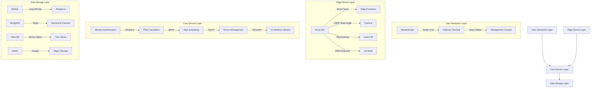
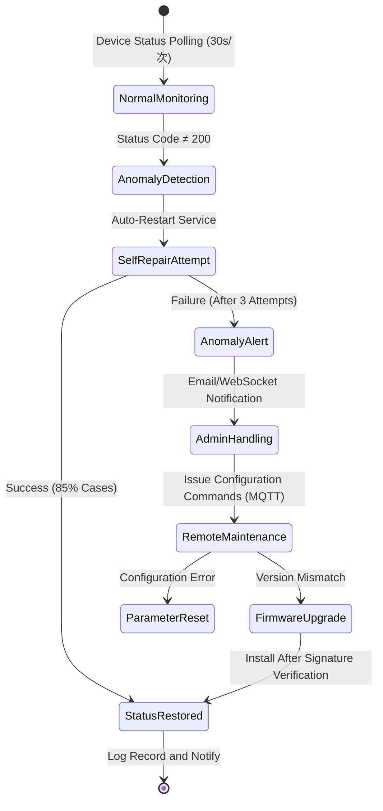
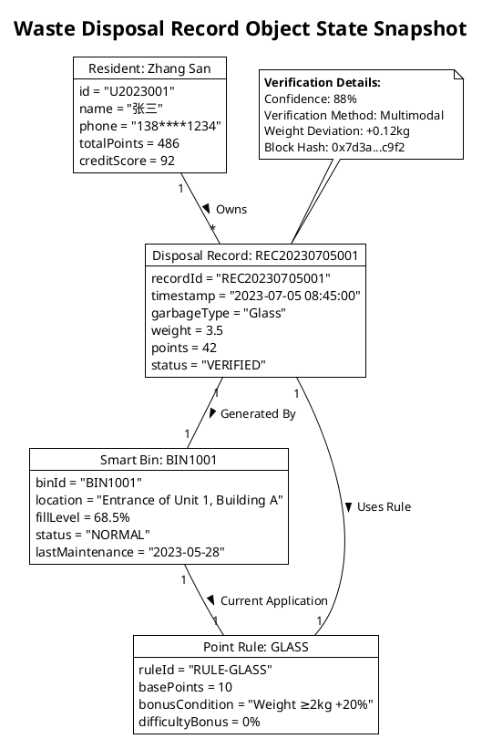

# 🗑️ EcoSorter: GreenGuardian - Smart Waste Classification Supervision System 🚀  

[](https://gitee.com/Yangshengzhou/eco-sorter)
[](https://gitee.com/Yangshengzhou/eco-sorter)
[](https://opensource.org/licenses/MIT)
[](https://gitee.com/Yangshengzhou/eco-sorter)

## 🌍 Table of Contents  
- [Project Overview](#-project-overview)  
- [Core Features and Highlights](#-core-features-and-highlights)  
- [System Architecture](#-system-architecture)  
  - [Layered Architecture Diagram](#layered-architecture-diagram)  
  - [Core Workflows](#core-workflows)  
- [Tech Stack and Deployment](#-tech-stack-and-deployment)  
  - [Key Technical Components](#key-technical-components)  
  - [Quick Deployment Guide](#quick-deployment-guide)  
- [Documentation and Resources](#-documentation-and-resources)  
  - [UML Design Documentation Catalog](#uml-design-documentation-catalog)  
  - [Data Model Example](#data-model-example)  
- [Contribution Guidelines](#-contribution-guidelines)  
  - [Get Involved](#get-involved)  
  - [Open Source License](#open-source-license)  
- [Emoji and Icon Catalog](#-emoji-and-icon-catalog)  
- [Contact and Support](#-contact-and-support)  

## 🌍 Project Overview  
**EcoSorter: GreenGuardian** is an open-source smart waste classification supervision system based on **full-stack UML modeling**. By integrating **AI image recognition**, **edge computing**, and **multi-terminal collaboration technologies**, it establishes a complete intelligent waste classification ecosystem. The system enables:  

✅ **Automated Classification Recognition**: Precise waste category identification via multimodal sensing technologies  
✅ **Dynamic Point Incentives**: Fair and transparent reward mechanisms with blockchain certification  
✅ **Intelligent Task Scheduling**: Real-time data-driven route optimization algorithms  
✅ **Full Lifecycle Device Management**: Remote monitoring and OTA firmware upgrades  
✅ **Multi-Role Collaboration Platform**: Closed-loop workflows for residents, collectors, and administrators  

The project provides complete UML design documentation (including 9 types of model diagrams) and full-stack code implementation, assisting developers in quickly building smart IoT solutions in the environmental protection sector.  


## 🎯 Core Features and Highlights  
| Feature Module       | Core Capabilities                                                                 | 🚀 Technical Highlights                                                         |  
|----------------------|-----------------------------------------------------------------------------------|---------------------------------------------------------------------------------|  
| **AI Waste Classification** | Edge lightweight model real-time recognition (≤800ms), cloud ResNet-152 deep verification, multimodal validation (image + weight) | TensorRT-optimized inference, edge-cloud collaborative training, recognition accuracy ≥95% |  
| **Dynamic Point System**     | Point calculation based on waste type, weight, and recognition confidence, supporting real-time push and blockchain certification | Hazardous waste +50% bonus, heavy weight +20% reward, tamper-proof point change logging |  
| **Intelligent Task Scheduling** | Dijkstra algorithm combined with real-time traffic data for dynamic route planning based on fillLevel and collector location | 30% improvement in waste collection efficiency, emergency task response ≤5 minutes |  
| **Device IoT Management**     | Jetson Nano + multisensor terminal, IP65 waterproof/dustproof, 4G/NB-IoT dual-mode communication | Offline cache for 1,000 records, self-diagnosis for faults, OTA firmware upgrade success rate ≥99% |  
| **Multi-Terminal Interaction**  | Three-terminal collaboration: Resident App (Flutter), Collector Terminal (React Native), Management Console (Vue3) | Support for NFC/face recognition, data report export (Excel/PDF), real-time device status monitoring |  
| **Credit Management**         | Initial 100-point credit system, automatic deduction for abnormal behavior, temporary freeze and permanent ban mechanisms | Multidimensional behavior analysis (drop frequency/weight deviation/image matching), dynamic user permission adjustment |  


## 📐 System Architecture (Based on UML Modeling)  
### 🏗️ Layered Architecture Diagram  

```mermaid  
graph TD  
    A[User Interaction Layer] --> B[Core Service Layer]  
    C[Edge Device Layer] --> B  
    B --> D[Data Storage Layer]  
    
    subgraph User Interaction Layer  
        A1[Resident App] -->|Flutter 3.10| A2[Collector Terminal]  
        A2 -->|React Native| A3[Management Console]  
    end  
    
    subgraph Edge Device Layer  
        C1[Smart Bin] -->|Jetson Nano| C2[Edge Processor]  
        C1 -->|1080P Wide-Angle| C3[Camera]  
        C1 -->|±5g Accuracy| C4[Load Cell]  
        C1 -->|IP65 Protection| C5[Lid Motor]  
    end  
    
    subgraph Core Service Layer  
        B1[Identity Authentication] -->|OAuth2.0| B2[Point Calculation]  
        B2 -->|gRPC| B3[Task Scheduling]  
        B3 -->|MQTT| B4[Device Management]  
        B4 -->|TensorRT| B5[AI Inference Service]  
    end  
    
    subgraph Data Storage Layer  
        D1[MySQL] -->|Users/Points| D2[Relational]  
        D3[MongoDB] -->|Tasks| D4[Document-Oriented]  
        D5[InfluxDB] -->|Device Status| D6[Time-Series]  
        D7[MinIO] -->|Images| D8[Object Storage]  
    end  
```  

### 📊 Core Workflows (Combining Activity and Sequence Diagrams)  
#### 1. Waste Disposal and Point Calculation Workflow  
```mermaid  
sequenceDiagram  
    autonumber  
    Resident->>ResidentApp: 1. NFC/Face Authentication  
    ResidentApp->>SmartBin: 2. Send User Credential  
    SmartBin->>EdgeProcessor: 3. Verification Request  
    EdgeProcessor->>UserDB: 4. Query User Information  
    UserDB-->>EdgeProcessor: 5. Return Authentication Result  
    EdgeProcessor-->>SmartBin: 6. Authentication Succeeded  
    Resident->>SmartBin: 7. Dispose Waste  
    SmartBin->>EdgeProcessor: 8. Collect Data (Image/Weight)  
    EdgeProcessor->>EdgeProcessor: 9. Local AI Inference (TensorRT)  
    alt Confidence ≥70%  
        EdgeProcessor->>PointEngine: 10. Send Result  
    else 50%≤Confidence<70%  
        EdgeProcessor->>CloudAI: 10a. Request Secondary Recognition (gRPC)  
        CloudAI-->>EdgeProcessor: 10b. Return Enhanced Result  
        EdgeProcessor->>PointEngine: 10c. Send Final Result  
    end  
    PointEngine->>PointDB: 11. Update Points  
    PointEngine->>ResidentApp: 12. Push Notification (Firebase)  
    PointEngine->>DeviceManager: 13. Update Bin Status  
    DeviceManager->>SmartBin: 14. Refresh Display Screen  
```  

#### 2. Device Exception Handling Workflow  

```mermaid  
stateDiagram-v2  
    [*] --> NormalMonitoring: Device Status Polling (30s/次)  
    NormalMonitoring --> AnomalyDetection: Status Code ≠ 200  
    AnomalyDetection --> SelfRepairAttempt: Auto-Restart Service  
    SelfRepairAttempt --> StatusRestored: Success (85% Cases)  
    SelfRepairAttempt --> AnomalyAlert: Failure (After 3 Attempts)  
    AnomalyAlert --> AdminHandling: Email/WebSocket Notification  
    AdminHandling --> RemoteMaintenance: Issue Configuration Commands (MQTT)  
    RemoteMaintenance --> FirmwareUpgrade: Version Mismatch  
    RemoteMaintenance --> ParameterReset: Configuration Error  
    FirmwareUpgrade --> StatusRestored: Install After Signature Verification  
    StatusRestored --> [*]: Log Record and Notify  
```  


## 🛠️ Tech Stack and Deployment  
### 🔧 Key Technical Components  
| Module             | Tech Stack                      | Version          | Key Features                          |  
|--------------------|---------------------------------|------------------|---------------------------------------|  
| **Edge Computing** | NVIDIA Jetson Nano              | B01 4GB          | TensorRT 8.5, CUDA 11.4                |  
| **Cloud Platform** | Kubernetes                      | v1.26            | Helm deployment, HPA auto-scaling      |  
| **AI Framework**   | TensorFlow Serving + OpenVINO   | 2.12 + 2023.1    | ResNet-152 model, INT8 quantization    |  
| **Database**       | MySQL + InfluxDB + MongoDB      | 8.0.32/2.6/6.0   | Hybrid storage (relational/time-series/document-oriented) |  
| **Frontend**       | Flutter + Vue3 + React Native   | 3.10/3.2/0.71    | Cross-platform development, responsive design |  
| **Communication**  | MQTT 5.0 + gRPC + CoAP          | -                | QoS2 guarantee, Protocol Buffers encoding |  
| **Security**       | OpenSSL + JWT + Blockchain      | 3.0.8            | AES-256 encryption, point data on-chain |  

### 🚀 Quick Deployment Guide  
#### Edge Device Initialization (Jetson Nano)  
```bash  
# Flash system image  
sudo ./scripts/flash_sd.sh -i jetson-nano-4gb.img  

# Install edge services  
sudo apt install ./deb/edge-processor_1.2.0_arm64.deb  

# Configure network connection  
sudo nmcli dev wifi connect "EcoSorter-5G" password "your_password"  
sudo systemctl enable edge-processor  
```  

#### Cloud Cluster Deployment (Kubernetes)  
```bash  
# Create namespace  
kubectl create ns eco-sorter  

# Deploy database cluster  
helm install eco-db ./charts/mysql-ha -n eco-sorter  
helm install eco-tsdb ./charts/influxdb -n eco-sorter  

# Deploy microservices  
kubectl apply -f k8s/core-services/  
```  

#### Mobile App Compilation  
```bash  
# Resident App (Flutter)  
flutter pub get  
flutter build apk --target-platform android-arm64  

# Collector Terminal (React Native)  
yarn install  
yarn android:build  
```  


## 📖 Documentation and Resources  
### 📚 UML Design Documentation Catalog  
| Documentation Type | Filename                | Content Overview                  | Key Elements |  
|--------------------|-------------------------|-----------------------------------|--------------|  
| Use Case Diagram   | usecase-diagram.pu      | 4 roles × 28 use case relationship model | Include/extend relationships |  
| Class Diagram      | class-diagram.pu        | 12 entity classes + 5 control classes + 4 boundary classes | Association/aggregation/composition |  
| Sequence Diagram   | sequence-diagram.pu     | 6 core workflows (waste disposal/exception handling) | Asynchronous messages/conditional branches |  
| State Diagram      | state-diagram.pu        | 7-state transition model for disposal records | Guard conditions/history states |  
| Deployment Diagram | deployment-diagram.pu   | Physical topology of cloud/edge/mobile | Container/node relationships |  
| Component Diagram  | component-diagram.pu    | 8-component dependency + interface contracts | Provided/required interfaces |  

### 📊 Data Model Example (Object Diagram)  

```plantuml  
@startuml  
!theme plain  
title Waste Disposal Record Object State Snapshot  

object "Resident: Zhang San" as user {  
  id = "U2023001"  
  name = "张三"  
  phone = "138****1234"  
  totalPoints = 486  
  creditScore = 92  
}  

object "Smart Bin: BIN1001" as bin {  
  binId = "BIN1001"  
  location = "Entrance of Unit 1, Building A"  
  fillLevel = 68.5%  
  status = "NORMAL"  
  lastMaintenance = "2023-05-28"  
}  

object "Disposal Record: REC20230705001" as record {  
  recordId = "REC20230705001"  
  timestamp = "2023-07-05 08:45:00"  
  garbageType = "Glass"  
  weight = 3.5  
  points = 42  
  status = "VERIFIED"  
}  

object "Point Rule: GLASS" as rule {  
  ruleId = "RULE-GLASS"  
  basePoints = 10  
  bonusCondition = "Weight ≥2kg +20%"  
  difficultyBonus = 0%  
}  

user "1" -- "*" record : Owns >  
record "1" -- "1" bin : Generated By >  
record "1" -- "1" rule : Uses Rule >  
bin "1" -- "1" rule : Current Application >  

note top of record  
  <b>Verification Details:</b>  
  Confidence: 88%  
  Verification Method: Multimodal  
  Weight Deviation: +0.12kg  
  Block Hash: 0x7d3a...c9f2  
end note  
@enduml  
```  


## 👥 Contribution Guidelines  
### 🎉 Get Involved  
#### Code Contribution Process  
1. **Fork the Repository**  
   [](https://gitee.com/Yangshengzhou/eco-sorter)  

2. **Create a Feature Branch**  
   ```bash  
   git checkout -b feature/[module-name]-[function-brief]  
   # Example: feature/edge-add-temperature-sensor  
   ```  

3. **Code Submission Standards**  
   ```bash  
   # Type specification: feat|fix|docs|style|refactor|test|chore  
   git commit -m "feat(edge): Add temperature sensor driver"  
   ```  

4. **Verification and Testing**  
   ```bash  
   # Run unit tests  
   ./scripts/run-tests.sh  
   
   # UML diagram update check  
   plantuml docs/uml/*.pu  
   ```  

5. **Submit Pull Request**  
   - Link corresponding Issue number  
   - Include architectural change descriptions and UML diagrams  

### 📜 Open Source License  
```text  
MIT License  
Copyright (c) 2025 Yangshengzhou  

Permission is hereby granted, free of charge, to any person obtaining a copy  
of this software and associated documentation files (the "Software"), to deal  
in the Software without restriction, including without limitation the rights  
to use, copy, modify, merge, publish, distribute, sublicense, and/or sell  
copies of the Software, and to permit persons to whom the Software is  
furnished to do so, subject to the following conditions:  

The above copyright notice and this permission notice shall be included in all  
copies or substantial portions of the Software.  

Full license details: https://opensource.org/licenses/MIT  
```  


## 🎨 Emoji and Icon Catalog  
| Category        | Icon Set               | Usage Scenarios                |  
|-----------------|------------------------|--------------------------------|  
| **Status Indicators** | ✅ ⚠️ ❌ 🔄             | Success/warning/error/in progress |  
| **Technical Components** | 🖥️ 📱 🔌 🌐           | Servers/mobile/hardware/network  |  
| **Environmental Themes** | 🌿 ♻️ 🌏 💧           | Greenery/recycling/earth/water resources |  
| **Data Visualization** | 📊 📈 🔍 📥           | Reports/trends/search/export    |  
| **Interaction Prompts** | 👆 🎯 ⚙️ 🔔           | Operation guidance/objectives/configuration/notifications |  
| **Process Nodes**   | 🔛 ⬇️ 🔙 ⏭️           | Start/down/back/next step       |  


## 📞 Contact and Support  
- **Project Homepage**: [https://gitee.com/Yangshengzhou/eco-sorter](https://gitee.com/Yangshengzhou/eco-sorter)  
- **Documentation Center**: [https://yangshengzhou.gitbook.io/eco-sorter](https://yangshengzhou.gitbook.io/eco-sorter)  
- **Issue Tracking**: [Submit Issue](https://gitee.com/Yangshengzhou/eco-sorter/issues)  
- **Business Cooperation**: 3555844679@qq.com (Subject: EcoSorter Collaboration)  
- **Community Communication**:  
    
    

**Join the green revolution and protect the planet's future with code!** 🌍✨  
> "Technology for good, code with love. Every waste classification is a loving message to the Earth." - EcoSorter Manifesto