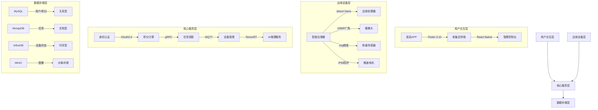
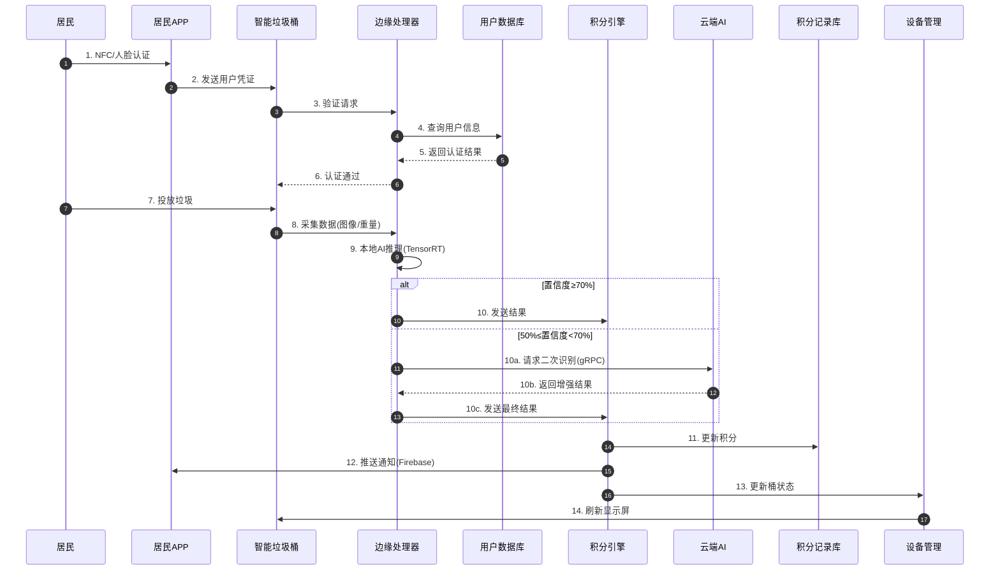
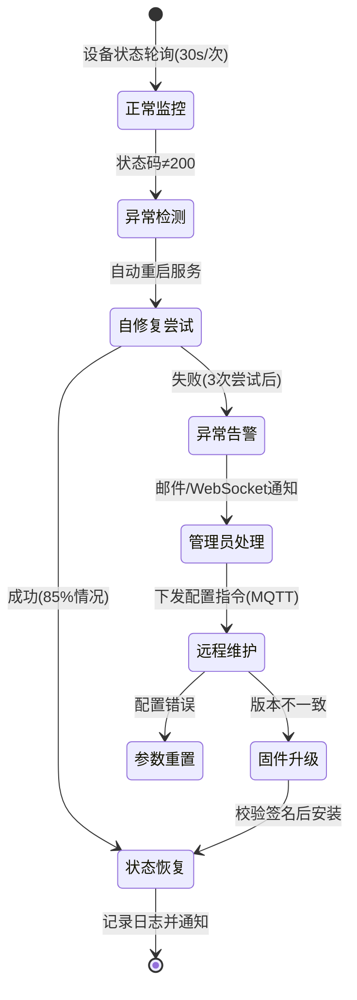
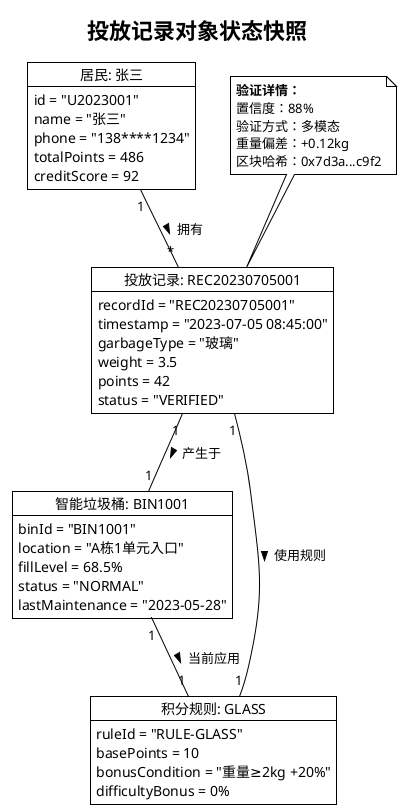

# 🗑️ EcoSorter: GreenGuardian - 智能垃圾分类督导系统 🚀  
[](https://gitee.com/Yangshengzhou/eco-sorter)
[](https://gitee.com/Yangshengzhou/eco-sorter)
[](https://opensource.org/licenses/MIT)
[](https://gitee.com/Yangshengzhou/eco-sorter)

## 🌍 目录
- [项目简介](#-项目简介)
- [核心功能与亮点](#-核心功能与亮点)
- [系统架构](#-系统架构)
  - [分层架构图](#分层架构图)
  - [核心流程](#核心流程)
- [技术栈与部署](#-技术栈与部署)
  - [关键技术组件](#关键技术组件)
  - [快速部署指南](#快速部署指南)
- [文档与资源](#-文档与资源)
  - [UML设计文档目录](#uml设计文档目录)
  - [数据模型示例](#数据模型示例)
- [贡献指南](#-贡献指南)
  - [欢迎参与](#欢迎参与)
  - [开源协议](#开源协议)
- [表情与图标目录](#-表情与图标目录)
- [联系与支持](#-联系与支持)

## 🌍 项目简介  
**EcoSorter: GreenGuardian** 是一款基于 **UML全栈建模** 的开源智能垃圾分类督导系统，通过融合 **AI图像识别**、**边缘计算** 和 **多端协同技术**，构建完整的垃圾智能分类生态。系统实现了：

✅ **自动化分类识别**：多模态感知技术精准识别垃圾类别  
✅ **动态积分激励**：区块链存证确保公平透明的奖励机制  
✅ **智能任务调度**：基于实时数据的路径优化算法  
✅ **设备全生命周期管理**：远程监控与OTA固件升级  
✅ **多角色协同平台**：居民/收集员/管理员全流程闭环  

项目提供完整的UML设计文档（含9类模型图）和全流程代码实现，助力开发者快速构建环保领域的智能物联网解决方案。

## 🎯 核心功能与亮点  
| 功能模块         | 核心特性                                                                 | 🚀 技术亮点                                                                 |
|------------------|--------------------------------------------------------------------------|--------------------------------------------------------------------------|
| **AI垃圾分类**   | 边缘端轻量模型实时识别（≤800ms），云端ResNet-152深度校验，多模态验证（图像+重量） | TensorRT优化推理，边缘-云端协同训练，识别准确率≥95%                      |
| **动态积分系统** | 基于垃圾类型、重量、识别置信度计算积分，支持实时推送与区块链存证          | 有害垃圾+50%加成，大重量+20%奖励，积分变动上链防篡改                     |
| **智能任务调度** | Dijkstra算法结合实时交通数据，基于fillLevel和收集员位置的动态路径规划     | 清运效率提升30%，紧急任务响应时间≤5分钟                                  |
| **设备物联网**   | Jetson Nano+多传感器终端，IP65防水防尘，4G/NB-IoT双模通信                | 离线缓存1000条记录，故障自诊断，OTA固件升级成功率≥99%                    |
| **多端交互**     | 三端协同：居民APP（Flutter）、收集员终端（React Native）、管理控制台（Vue3） | 支持NFC/人脸识别，数据报表导出（Excel/PDF），实时设备状态监控            |
| **信用管理**     | 初始100分信用体系，异常行为自动扣分，临时冻结与永久封禁机制               | 多维度行为分析（投放频次/重量偏差/图像匹配度），动态调整用户权限         |

## 📐 系统架构（基于UML建模）  
### 🏗️ 分层架构图  


### 📊 核心流程（结合活动图与顺序图）  
#### 1. 垃圾投放与积分计算流程  


#### 2. 设备异常处理流程  


## 🛠️ 技术栈与部署  
### 🔧 关键技术组件  
| 模块             | 技术栈                          | 版本           | 关键特性                          |
|------------------|--------------------------------|----------------|----------------------------------|
| **边缘计算**     | NVIDIA Jetson Nano             | B01 4GB        | TensorRT 8.5, CUDA 11.4          |
| **云端平台**     | Kubernetes                     | v1.26          | Helm部署，HPA自动扩缩容           |
| **AI框架**       | TensorFlow Serving + OpenVINO  | 2.12 + 2023.1  | ResNet-152模型，INT8量化          |
| **数据库**       | MySQL + InfluxDB + MongoDB     | 8.0.32/2.6/6.0 | 关系型+时序型+文档型混合存储       |
| **前端**         | Flutter + Vue3 + React Native  | 3.10/3.2/0.71  | 跨平台开发，响应式设计             |
| **通信协议**     | MQTT 5.0 + gRPC + CoAP         | -              | QoS2保证，Protocol Buffers编码    |
| **安全**         | OpenSSL + JWT + Blockchain     | 3.0.8          | AES-256加密，积分数据上链          |

### 🚀 快速部署指南  
#### 边缘设备初始化 (Jetson Nano)
```bash
# 刷写系统镜像
sudo ./scripts/flash_sd.sh -i jetson-nano-4gb.img

# 安装边缘服务
sudo apt install ./deb/edge-processor_1.2.0_arm64.deb

# 配置网络连接
sudo nmcli dev wifi connect "EcoSorter-5G" password "your_password"
sudo systemctl enable edge-processor
```

#### 云端集群部署 (Kubernetes)
```bash
# 创建命名空间
kubectl create ns eco-sorter

# 部署数据库集群
helm install eco-db ./charts/mysql-ha -n eco-sorter
helm install eco-tsdb ./charts/influxdb -n eco-sorter

# 部署微服务
kubectl apply -f k8s/core-services/
```

#### 移动端编译
```bash
# 居民APP (Flutter)
flutter pub get
flutter build apk --target-platform android-arm64

# 收集员终端 (React Native)
yarn install
yarn android:build
```

## 📖 文档与资源  
### 📚 UML设计文档目录  
| 文档类型       | 文件名                  | 内容概述                          | 关键要素 |
|----------------|-------------------------|-----------------------------------|----------|
| 用例图         | usecase-diagram.pu      | 4角色×28用例关系模型              | 包含/扩展关系 |
| 类图           | class-diagram.pu        | 12实体类+5控制类+4边界类定义      | 关联/聚合/组合 |
| 顺序图         | sequence-diagram.pu     | 垃圾投放/异常处理等6个核心流程    | 异步消息/条件分支 |
| 状态图         | state-diagram.pu        | 投放记录7状态转换模型             | 监护条件/历史状态 |
| 部署图         | deployment-diagram.pu   | 云端+边缘+移动端物理拓扑          | 容器/节点关系 |
| 组件图         | component-diagram.pu    | 8组件依赖+接口契约                | 提供/需求接口 |

### 📊 数据模型示例（对象图）  


## 👥 贡献指南  
### 🎉 欢迎参与  
#### 代码贡献流程
1. **Fork仓库**  
   [](https://gitee.com/Yangshengzhou/eco-sorter)

2. **创建特性分支**  
   ```bash
   git checkout -b feature/[模块名]-[功能简述]
   # 示例: feature/edge-add-temperature-sensor
   ```

3. **提交代码规范**  
   ```bash
   # 类型说明: feat|fix|docs|style|refactor|test|chore
   git commit -m "feat(edge): 新增温湿度传感器驱动"
   ```

4. **验证与测试**  
   ```bash
   # 运行单元测试
   ./scripts/run-tests.sh
   
   # UML图更新检查
   plantuml docs/uml/*.pu
   ```

5. **发起Pull Request**  
   - 关联对应Issue编号  
   - 附架构变更说明及UML图  

### 📜 开源协议  
```text
MIT License
Copyright (c) 2025 Yangshengzhou

特此免费授予获得本软件及相关文档文件（“软件”）副本的任何人无限制使用软件的权利，
包括但不限于使用、复制、修改、合并、发布、分发、再许可的权利。被授权人有权利使用、
复制、修改、合并、出版、分发、再许可和/或销售本软件的副本。

完整协议详见：https://opensource.org/licenses/MIT
```

## 🎨 表情与图标目录  
| 分类          | 图标集                 | 使用场景                     |
|---------------|-----------------------|----------------------------|
| **状态指示**  | ✅ ⚠️ ❌ 🔄            | 成功/警告/错误/进行中       |
| **技术组件**  | 🖥️ 📱 🔌 🌐            | 服务器/移动端/硬件/网络     |
| **环保主题**  | 🌿 ♻️ 🌏 💧            | 绿植/回收/地球/水资源       |
| **数据展示**  | 📊 📈 🔍 📥            | 报表/趋势/搜索/导出         |
| **交互提示**  | 👆 🎯 ⚙️ 🔔            | 操作指引/目标/配置/通知     |
| **流程节点**  | 🔛 ⬇️ 🔙 ⏭️            | 开始/向下/返回/下一步       |

## 📞 联系与支持  
- **项目主页**：[https://gitee.com/Yangshengzhou/eco-sorter](https://gitee.com/Yangshengzhou/eco-sorter)  
- **文档中心**：[https://yangshengzhou.gitbook.io/eco-sorter](https://yangshengzhou.gitbook.io/eco-sorter)  
- **问题反馈**：[提交Issue](https://gitee.com/Yangshengzhou/eco-sorter/issues)  
- **商务合作**：3555844679@qq.com（主题注明"EcoSorter合作"）  
- **社区交流**：  
    
    

**加入绿色革命，用代码守护地球未来！** 🌍✨  
> "科技向善，代码有爱。每一次垃圾分类，都是对地球的深情告白。" - EcoSorter宣言