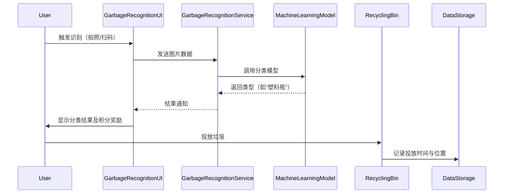
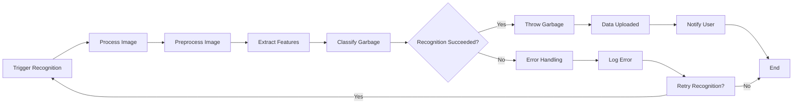
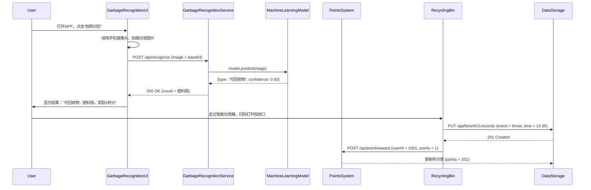

# 🌿 **EcoSorter** — 智能垃圾分类督导系统 · 需求分析设计  
[](https://gitee.com/Yangshengzhou/eco-sorter)
[](https://opensource.org/licenses/MIT)

### 目录
- [一、系统概述](#一系统概述)
- [二、用户角色](#二用户角色)
  - [2.1 居民 👥](#21-居民-👥)
  - [2.2 系统管理员 👨💻](#22-系统管理员-👨💻)
  - [2.3 智能垃圾桶 🗑️](#23-智能垃圾桶-🗑️)
  - [2.4 垃圾收集员 🧹](#24-垃圾收集员-🧹)
  - [2.5 紧急通知模块 🚨](#25-紧急通知模块-🚨)
- [三、系统功能需求](#三系统功能需求)
  - [3.1 垃圾分类识别 🤖](#31-垃圾分类识别-🤖)
  - [3.2 积分奖励机制 🌟](#32-积分奖励机制-🌟)
  - [3.3 教育与宣传 📚](#33-教育与宣传-📚)
  - [3.4 数据可视化 📊](#34-数据可视化-📊)
  - [3.5 报告生成 📄](#35-报告生成-📄)
  - [3.6 用户管理 👤](#36-用户管理-👤)
  - [3.7 反馈系统 📩](#37-反馈系统-📩)
- [四、非功能需求](#四非功能需求)
  - [4.1 准确性 ✅](#41-准确性-✅)
  - [4.2 响应速度 ⚡](#42-响应速度-⚡)
  - [4.3 安全性 🔒](#43-安全性-🔒)
  - [4.4 可扩展性 🌐](#44-可扩展性-🌐)
  - [4.5 可靠性 🛠️](#45-可靠性-🛠️)
- [五、子系统设计](#五子系统设计)
  - [5.1 用户交互子系统 📱](#51-用户交互子系统-📱)
  - [5.2 AI处理子系统 🤖](#52-ai处理子系统-🤖)
  - [5.3 积分管理子系统 🌟](#53-积分管理子系统-🌟)
  - [5.4 数据统计分析子系统 📊](#54-数据统计分析子系统-📊)
  - [5.5 后台管理子系统 👨💻](#55-后台管理子系统-👨💻)
- [六、信息管理](#六信息管理)
  - [6.1 用户信息 📇](#61-用户信息-📇)
  - [6.2 垃圾分类信息 🗄️](#62-垃圾分类信息-🗄️)
  - [6.3 积分交易信息 💰](#63-积分交易信息-💰)
  - [6.4 系统日志 📝](#64-系统日志-📝)
- [七、UML图说明](#七uml图说明)
  - [7.1 用例图 📌](#71-用例图-📌)
  - [7.2 类图 🏷️](#72-类图-🏷️)
  - [7.3 对象图 实例 👥](#73-对象图-实例-👥)
  - [7.4 包图 📦](#74-包图-📦)
  - [7.5 顺序图/协作图 🔄](#75-顺序图协作图-🔄)
  - [7.6 状态图 ⏳](#76-状态图-⏳)
  - [7.7 活动图 🏃](#77-活动图-🏃)
  - [7.8 组件图 🔌](#78-组件图-🔌)
  - [7.9 部署图 🌐](#79-部署图-🌐)
- [八、状态图详细描述](#八状态图详细描述)
  - [8.1 状态流转 🔁](#81-状态流转-🔁)
  - [8.2 关键事件 📅](#82-关键事件-📅)
- [九、活动图详细描述](#九活动图详细描述)
  - [9.1 主流程 ✅](#91-主流程-✅)
  - [9.2 决策点 ⚖️](#92-决策点-⚖️)
- [十、协作图详细描述](#十协作图详细描述)
  - [10.1 对象交互 👥🗨️](#101-对象交互-👥🗨️)
- [十一、顺序图详细描述](#十一顺序图详细描述)
  - [11.1 时序流程 ⏱️](#111-时序流程-⏱️)
- [十二、包图详细描述](#十二包图详细描述)
  - [12.1 模块依赖 📦→📦](#121-模块依赖-📦→📦)
- [十三、另一协作图详细描述](#十三另一协作图详细描述)
  - [13.1 数据关联 🔗](#131-数据关联-🔗)
- [十四、用例图详细描述](#十四用例图详细描述)
  - [14.1 角色功能矩阵 🧩](#141-角色功能矩阵-🧩)
- [十五、组件图详细描述](#十五组件图详细描述)
  - [15.1 技术架构 🏗️](#151-技术架构-🏗️)
- [十六、部署图详细描述](#十六部署图详细描述)
  - [16.1 物理架构 🌐](#161-物理架构-🌐)

---

### 一、系统概述 🌱

在当今社会，垃圾分类对于城市的绿色可持续发展至关重要。为了实现社区垃圾分类的智能化管理，提升居民的参与度，同时降低运营成本，我们设计了EcoSorter智能垃圾分类督导系统。本系统综合运用AI图像识别、积分激励、数据可视化等核心技术，全面覆盖了垃圾分类的各个环节，从垃圾的识别分类到用户的激励引导，再到数据的分析和管理，为社区垃圾分类提供了一站式的解决方案。通过本系统，不仅能够自动、准确地识别垃圾类型，还能通过积分奖励机制鼓励居民积极参与正确的垃圾分类行为。同时，丰富的数据分析工具能够帮助管理者深入了解垃圾分类的情况，做出科学合理的决策，从而推动城市的绿色发展。

### 二、用户角色 👥👨💻🗑️🧹🚨

#### 2.1 居民 👥

居民作为社区垃圾分类的直接参与者，在整个系统中扮演着关键的角色。他们的日常行为直接影响着垃圾分类的效果。居民可以通过以下方式参与垃圾分类：
- **垃圾投放**：居民可以选择扫描垃圾桶上的二维码，系统将自动识别垃圾类型；也可以手动选择垃圾类型，完成垃圾投放。这种多样化的投放方式方便了不同场景下居民的使用。
- **积分管理**：居民可以随时查询自己的积分总额和明细记录，了解自己在垃圾分类活动中的贡献。同时，他们还能参与各种活动，用积分兑换丰富多样的礼品，如日用品、环保用品等，这极大地激发了居民参与垃圾分类的积极性。
- **信息获取**：系统会定期向居民推送分类指南、政策通知及活动邀请等信息。通过这些信息，居民能够及时了解最新的垃圾分类知识和社区活动，提高自身的环保意识和行动力。

#### 2.2 系统管理员 👨💻

系统管理员是系统运维与数据管理的核心角色，负责确保系统的稳定运行和数据的安全可靠。他们的主要职责包括：
- **系统维护**：管理员需要定期进行软件版本更新，以保证系统具备最新的功能和安全补丁；同时，进行数据备份与恢复工作，防止数据丢失；在系统出现故障时，及时进行修复，确保系统的正常运行。
- **用户管理**：管理员负责对新用户的注册进行审核，确保用户信息的真实性和合法性；根据用户的角色和职责，进行权限配置，保证不同用户只能访问其权限范围内的功能和数据；当用户忘记密码时，管理员可以进行密码重置操作；此外，还需要实时监控用户的状态，及时发现并处理异常情况。
- **系统配置**：管理员需要对垃圾桶的参数进行设置，如识别灵敏度、满溢预警阈值等；定义活动规则，包括积分计算规则、活动奖励机制等；管理通知策略，确保在合适的时间以合适的方式向用户发送通知。

#### 2.3 智能垃圾桶 🗑️

智能垃圾桶作为垃圾分类的智能终端设备，具备先进的自动识别和数据交互功能。它的主要操作包括：
- **自动识别**：智能垃圾桶配备了高精度的图像传感器，能够实时采集垃圾的图像。通过调用先进的AI模型，垃圾桶可以对垃圾进行实时分类，准确判断垃圾的类型。
- **数据交互**：智能垃圾桶通过网络连接云端服务器，将识别结果、投放记录以及设备状态等数据上传至服务器。这些数据对于系统的数据分析和管理至关重要。
- **通知触发**：当垃圾桶出现满溢或故障等异常情况时，会立即触发通知机制，通过短信、APP推送等方式将异常信息实时发送给管理员，以便管理员及时处理。

#### 2.4 垃圾收集员 🧹

垃圾收集员的主要任务是维护垃圾桶的状态并执行垃圾收运工作，确保垃圾分类工作的顺利进行。他们的工作内容包括：
- **设备巡检**：垃圾收集员需要定期检查垃圾桶的清洁度和运行状态，及时发现并记录垃圾桶的故障信息，如传感器损坏、门锁故障等。
- **垃圾收运**：在收运垃圾时，垃圾收集员通过扫描垃圾桶二维码，记录收运时间、垃圾重量及类别等信息。这些信息有助于后续的数据分析和管理。
- **数据上报**：垃圾收集员可以通过移动端应用提交工作记录和异常反馈。例如，当发现某个垃圾桶频繁出现故障时，可以及时上报，以便管理员安排维修。

#### 2.5 紧急通知模块 🚨

紧急通知模块是系统异常时的应急响应组件，能够确保在紧急情况下及时通知相关人员。它的主要功能包括：
- **多级通知**：该模块支持多种通知渠道，如短信、APP推送、语音报警等。根据紧急情况的严重程度和通知对象的不同，可以选择合适的通知方式。
- **快速触发**：当设备出现故障、数据异常等紧急事件时，紧急通知模块会自动触发通知链，确保相关人员能够在第一时间得知情况并采取相应的措施。

### 三、系统功能需求 🤖🌟📚📊📄📩

EcoSorter系统集成了多种功能，以满足不同用户的需求，推动垃圾分类工作的高效开展。

#### 3.1 垃圾分类识别 🤖
- **技术实现**：系统基于深度学习的图像识别算法，如ResNet，对常见的垃圾类型，如可回收物、厨余垃圾、有害垃圾和其他垃圾等进行实时分类。该算法经过大量的训练数据优化，具有较高的识别准确率。
- **用户体验**：在居民投放垃圾时，系统会同步显示识别结果。如果居民分类错误，系统会立即给予语音提示，并提供图文指导，帮助居民正确分类垃圾。

#### 3.2 积分奖励机制 🌟
- **积分规则**：系统制定了详细的积分规则，鼓励居民积极参与垃圾分类。正确分类投放一次可获得1积分，对于厨余垃圾的正确投放，给予双倍积分奖励。此外，居民参与邀请好友、完成问卷调查等活动，也能获得额外的积分奖励。
- **兑换体系**：积分商城提供了丰富的商品供居民兑换，包括日用品、环保礼品等多个品类。商城会实时更新库存，确保居民能够及时兑换到心仪的商品。

#### 3.3 教育与宣传 📚
- **知识库**：系统建立了图文和视频形式的知识库，内容涵盖分类指南、政策解读、典型案例库等。居民可以通过移动端APP或Web端随时访问这些知识，提高自己的垃圾分类水平。
- **活动管理**：系统组织了线上打卡挑战、线下讲座等活动，支持居民进行活动报名和进度跟踪。通过这些活动，增强居民的环保意识和参与度。

#### 3.4 数据可视化 📊
- **实时看板**：系统提供实时看板，展示社区当日的垃圾投放量、分类准确率、垃圾桶状态分布等信息。管理者可以通过实时看板及时了解社区垃圾分类的情况，发现问题并及时处理。
- **趋势分析**：系统会按周、月、年为单位生成分类质量报告、用户活跃度排名及设备故障率图表。通过对这些数据的分析，管理者可以了解垃圾分类的发展趋势，为制定决策提供依据。

#### 3.5 报告生成 📄
- **自动生成**：系统会自动生成月度、季度、年度报告，报告内容包括分类成效、资源消耗、用户行为分析等。这些报告能够全面反映社区垃圾分类的情况，为政府监管部门和社区物业提供重要的参考。
- **导出功能**：报告支持PDF、Excel格式导出，方便政府监管部门和社区物业进行备案和进一步的分析。

#### 3.6 用户管理 👤
- **多端登录**：系统支持手机号、微信、身份证等多种方式注册，同时提供面部识别快速登录功能，方便用户使用。
- **隐私保护**：系统对用户住址、联系方式等敏感信息进行加密存储，遵循权限最小化原则，确保用户信息的安全和隐私。

#### 3.7 反馈系统 📩
- **双向沟通**：用户可以通过系统提交分类疑问、设备故障或建议等反馈信息。管理员会在48小时内对用户的反馈进行响应，确保用户的问题得到及时解决。
- **问题归档**：系统会对常见问题进行自动匹配知识库解答，同时对历史反馈进行归档处理，方便后续的查询和追溯。

### 四、非功能需求 ✅⚡🔒🌐🛠️

除了丰富的功能外，EcoSorter还注重系统的性能和安全性，以确保系统的稳定运行和用户数据的安全。

#### 4.1 准确性 ✅
- **识别率**：系统在训练集上的准确率达到了95%以上，在实际应用场景中的准确率也超过了90%。为了保证识别率的稳定性，系统会定期对模型进行优化和更新。
- **数据精度**：积分计算的误差率控制在0.1%以内，设备状态监控的实时性误差不超过5分钟，确保数据的准确性和可靠性。

#### 4.2 响应速度 ⚡
- **交互延迟**：移动端界面的操作响应时间不超过1秒，AI识别结果的返回时间控制在3秒以内，确保用户能够获得流畅的使用体验。
- **通知时效**：紧急通知从触发到送达的时间不超过5分钟，普通消息的送达时间不超过30分钟，保证信息的及时传递。

#### 4.3 安全性 🔒
- **数据加密**：系统在传输层采用HTTPS协议对数据进行加密，防止数据在传输过程中被窃取或篡改。在存储层，对用户信息、图像数据等敏感数据进行AES - 256加密，确保数据的安全性。
- **权限控制**：系统采用基于角色的访问控制（RBAC）机制，根据用户的角色和职责分配不同的权限。同时，对管理员的操作日志进行全量审计，确保操作的可追溯性。

#### 4.4 可扩展性 🌐
- **技术架构**：系统采用微服务架构设计，支持容器化部署（如Docker）和动态扩容。这种架构设计使得系统能够根据业务需求灵活调整资源配置，提高系统的可扩展性。
- **功能扩展**：系统预留了硬件接口，如称重传感器、RFID标签读写器等，方便后续的功能扩展。同时，支持多社区级联管理，满足大规模社区的垃圾分类管理需求。

#### 4.5 可靠性 🛠️
- **系统可用性**：系统的可用性达到99.9%以上，关键业务的故障恢复时间不超过1小时。通过冗余设计和备份策略，确保系统在出现故障时能够快速恢复。
- **容灾备份**：数据库每日进行全量备份，应用服务器采用异地灾备方案，支持分钟级切换。在发生重大灾害或故障时，能够保证数据的安全性和系统的快速恢复。

### 五、子系统设计 📱🤖🌟📊👨💻

EcoSorter由多个子系统组成，每个子系统都有明确的功能定位，共同协作实现系统的整体功能。

#### 5.1 用户交互子系统 📱
- **职责**：该子系统提供移动端APP（支持iOS和Android系统）和Web端界面，方便用户进行垃圾投放、积分查询等操作。同时，集成了摄像头调用、扫码识别、消息推送等功能模块，为用户提供便捷的交互体验。
- **技术选型**：采用React Native进行跨平台开发，搭配Redux状态管理库，提高开发效率和代码的可维护性。

#### 5.2 AI处理子系统 🤖
- **职责**：该子系统负责图像预处理、特征提取和分类模型推理等工作。同时，利用社区投放数据持续迭代算法，不断提高识别精度。
- **技术选型**：使用TensorFlow框架进行模型训练和推理，借助NVIDIA GPU加速推理过程，提高处理速度。采用Kubernetes管理训练任务，实现资源的高效利用和任务的自动化调度。

#### 5.3 积分管理子系统 🌟
- **职责**：该子系统实现积分计算、冻结、扣除规则引擎，支持活动奖励的批量发放。同时，负责兑换订单的管理，包括库存校验、物流跟踪和售后处理等。
- **数据模型**：建立积分流水表，记录积分变动的类型、时间和数量；建立礼品兑换表，记录礼品ID、积分消耗、用户地址等信息，方便进行对账和审计。

#### 5.4 数据统计分析子系统 📊
- **职责**：该子系统采集用户行为数据（如投放记录、积分变动）和设备数据（如状态、位置），进行数据清洗和聚合分析，生成可视化报表和预警指标，为管理者提供决策支持。
- **技术选型**：采用Flink进行实时流处理，Hadoop进行离线分析，ECharts进行数据可视化，确保数据处理的高效性和可视化效果。

#### 5.5 后台管理子系统 👨💻
- **职责**：该子系统为管理员提供全面的管理工具，包括用户管理、设备监控和系统配置等功能。同时，对操作日志进行审计，记录操作轨迹和异常事件，支持关键字检索和导出。
- **权限体系**：采用超级管理员、区域管理员、普通管理员三级权限体系，确保不同级别的管理员只能进行其权限范围内的操作，操作留痕可追溯。

### 六、信息管理 📇🗄️💰📝

有效的信息管理是EcoSorter成功运行的关键，系统对各类信息进行了详细的管理和维护。

#### 6.1 用户信息 📇
- **字段**：用户信息包括用户ID、姓名、手机号、住址、积分、注册时间、账户状态等。这些信息全面记录了用户的基本情况和参与垃圾分类的情况。
- **存储**：采用分布式数据库（如MySQL Cluster）存储用户信息，对敏感字段进行加密处理，并定期进行数据脱敏处理，确保用户信息的安全和隐私。

#### 6.2 垃圾分类信息 🗄️
- **字段**：垃圾分类信息记录了每次投放的详细信息，包括记录ID、用户ID、垃圾图片、分类结果、投放时间、垃圾桶编号、经纬度等。
- **用途**：这些数据不仅用于训练AI模型，提高识别准确率，还可以帮助分析区域内的分类趋势，定位高频误投点，为优化垃圾分类工作提供依据。

#### 6.3 积分交易信息 💰
- **字段**：积分交易信息包括交易ID、用户ID、积分变动类型（获取/消耗）、数量、时间、关联活动/兑换记录等。
- **场景**：这些信息可用于用户对账、运营复盘（如活动ROI分析）、异常积分核查等，确保积分交易的公平性和透明度。

#### 6.4 系统日志 📝
- **字段**：系统日志记录了所有的操作轨迹，包括日志ID、操作人、模块名称、操作内容、时间、IP地址、响应状态等。
- **审计**：支持按时间段、模块、操作类型等条件筛选日志，对异常日志自动标记预警，方便管理员进行系统监控和问题排查。

### 七、UML图说明 📌🏷️👥📦🔄⏳🏃🔌🌐

#### 7.1 用例图 📌
- **核心作用**：用例图定义了系统的边界，清晰地描述了角色与功能之间的交互关系。通过用例图，可以直观地了解系统的功能范围和各个角色的职责。
- **角色划分**：
  - **主动角色**：包括居民、系统管理员、垃圾收集员等人类参与者，他们主动与系统进行交互，完成各自的任务。
  - **被动角色**：智能垃圾桶作为设备角色，紧急通知模块作为系统组件，它们在系统中被动地接收和处理信息。
- **用例关系示例**：
  - **包含关系**：“投放垃圾”用例包含“扫描二维码”和“选择垃圾类型”等基础操作步骤，这些步骤是投放垃圾过程中必不可少的环节。
  - **扩展关系**：“查询积分”用例可以扩展为“查看积分明细”，当用户点击“明细”按钮时，系统会展示积分的详细变动情况。
  - **泛化关系**：“系统管理员”泛化为“超级管理员”和“区域管理员”，不同级别的管理员具有不同的权限和职责。
- **可视化价值**：用例图在需求评审时非常有用，可以帮助团队成员对齐业务流程，确保所有角色的核心诉求都被覆盖。


#### 7.2 类图 🏷️

##### 关键类说明

| 类名         | 属性示例                     | 方法示例                      | 关系说明             |
|--------------|------------------------------|-------------------------------|----------------------|
| **User**     | id, name, phone, points      | queryPoints(), redeemGift()   | 聚合 → 积分记录      |
| **Garbage**  | imagePath, type, timestamp   | submitForRecognition()        | 关联 → 垃圾桶        |
| **BinManager** | binId, location, status    | checkStatus(), recordCleaning() | 依赖 → 数据存储     |
| **AIProcessor** | modelVersion, accuracy    | preprocessImage(), classify() | 实现 → ImageRecognition 接口 |

---

##### 类间关系说明

| 关系类型     | 示例                         | 描述                                                                 | UML 符号                   |
|--------------|------------------------------|----------------------------------------------------------------------|----------------------------|
| **继承**     | 居民 → 系统用户              | 子类继承父类的属性与方法                                             | 实线 + 空心三角（←）       |
| **关联**     | 用户 → 积分记录              | 两个类之间存在固定的连接关系                                         | 实线 + 箭头                |
| **依赖**     | AI处理器 → 数据库            | 一个类的变化可能影响另一个类，通常为临时使用关系                   | 虚线 + 箭头                |
| **聚合**     | 用户 → 积分记录              | 整体与部分的关系，部分可独立存在                                     | 实线 + 空心菱形            |
| **组合**     | —                            | 强关联的整体与部分关系，部分不能独立于整体存在                       | 实线 + 实心菱形            |
| **实现**     | AIProcessor → ImageRecognition 接口 | 类实现了某个接口定义的行为                                          | 虚线 + 空心三角           |


#### 7.3 对象图 实例 👥
- **核心作用**：对象图展示了类的实例化状态，用于验证数据交互逻辑。通过对象图，可以直观地看到系统中各个对象之间的关系和数据流动情况。
- **示例场景**：以用户“张三”投放可回收物的记录为例：
```
User {
  id: 1001,
  name: "张三",
  points: 200,
  records: [GarbageCollectionRecord#1]
}
GarbageCollectionRecord#1 {
  recordId: "20250528001",
  userId: 1001,
  garbageType: "可回收物",
  binId: "A01",
  time: "2025-05-28 14:30:00"
}
RecyclingBin#A01 {
  binId: "A01",
  location: "1号楼东侧",
  status: "正常"
}
```
- **用途**：在数据库设计阶段，对象图可以辅助ER图验证，确保实体 - 关系映射的正确性。


#### 7.4 包图 📦
- **核心作用**：包图以模块化的方式组织系统组件，清晰地展示了各个组件之间的依赖关系。通过包图，可以了解系统的整体架构和模块划分。
- **包结构设计**：
```
智能垃圾分类系统
├─ 用户交互包（UI）
│  ├─ 移动端APP
│  └─ Web管理端
├─ 业务逻辑包（Service）
│  ├─ 垃圾识别服务
│  ├─ 积分管理服务
│  └─ 设备监控服务
├─ 数据处理包（Data）
│  ├─ 数据库模块（RDS）
│  └─ 云存储模块（OSS）
├─ 基础架构包（Infra）
│  ├─ 日志服务
│  └─ 通知服务
└─ 第三方服务包（3rd Party）
   ├─ AI模型服务（TensorFlow）
   └─ 地图服务（高德/百度）
```
- **依赖关系**：
  - **UI包** → **Service包**：通过RESTful API（JSON格式）调用业务逻辑，实现用户界面与业务逻辑的分离。
  - **Service包** → **Data包**：读写数据，将业务逻辑与数据存储进行解耦。
  - **Infra包** → **Data包**：日志和通知数据存储在数据处理包中，确保系统的日志和通知信息得到有效的管理。


#### 7.5 顺序图/协作图 🔄
- **核心作用**：顺序图和协作图用于描述对象间交互的时序和协作关系。顺序图强调对象间交互的时间顺序，协作图则更注重对象间的空间关系。
- **顺序图示例：垃圾识别流程**

- **协作图重点**：对象间通过`userId`、`binId`等键值关联，强调“空间关系”而非时间顺序，有助于理解对象之间的协作方式。


#### 7.6 状态图 ⏳
- **核心作用**：状态图描述了对象状态迁移的过程，适用于流程控制场景。通过状态图，可以清晰地了解系统在不同状态下的行为和转换条件。
- **垃圾识别状态机**：
```
[*] --> Idle
Idle --> DataProcessing: TriggerRecognition
DataProcessing --> Recognition: ImageSent
Recognition --> ResultDisplayed: RecognitionSucceeded
ResultDisplayed --> Completed: GarbageThrown
Completed --> DataStorage: DataUploaded
DataStorage --> [*]: 结束
```
- **异常分支**：
  - Recognition --> ErrorHandling: RecognitionFailed
  - ErrorHandling --> Idle: RetryTriggered


#### 7.7 活动图 🏃
- **核心作用**：活动图展示了业务流程的步骤、决策点和并行路径。通过活动图，可以全面了解业务流程的全貌，发现潜在的问题和优化点。
- **主流程活动图**：



#### 7.8 组件图 🔌
- **核心作用**：组件图描述了系统的物理组件及其依赖关系。通过组件图，可以了解系统的硬件和软件组件的组成结构，以及它们之间的交互方式。
- **技术组件架构**：
```
+----------------+    +----------------+    + -------------+
|  User Interface|    | Image Processing|    | Machine Learning|
|    (React)     | --> |    Service     | --> |     Model     |
+-------+--------+    +-------+--------+    +------+--------+
        |                        |                    ^
        |                        |                    |
+-------v--------+    +-------v--------+    +------v--------+
| Notification   |    |     Cloud     |    |     Database  |
|    Service     |    |    Storage     |    |    (MySQL)    |
+----------------+    +----------------+    +---------------+
```
- **接口定义**：
  - **ImageProcessingAPI**：`POST /api/recognize`（接收图片，返回分类结果）
  - **NotificationAPI**：`POST /api/notify`（发送APP通知/短信）


#### 7.9 部署图 🌐
- **核心作用**：部署图规划了硬件与软件的物理部署，明确了网络通信路径。通过部署图，可以了解系统在实际环境中的部署情况，确保系统的稳定性和可靠性。
- **三层架构设计**：
  - **终端层**：
    - 居民手机（iOS/Android APP）：通过4G/5G网络连接云端，实现与系统的交互。
    - 智能垃圾桶（硬件配置：ARM处理器 + 摄像头 + IoT模组）：支持Wi-Fi/Bluetooth/4G联网，边缘计算模块对图像进行预处理，减少数据传输量。
  - **云端层**：
    - **应用服务器**：采用阿里云ECS（多可用区部署），运行Spring Boot/Node.js微服务，通过Nginx进行负载均衡，提高系统的可用性和性能。
    - **数据库服务器**：使用阿里云RDS for PostgreSQL（主从复制 + 读写分离），存储核心业务数据，确保数据的安全性和可靠性。
    - **AI服务器**：阿里云GPU实例（NVIDIA A100），部署TensorFlow模型服务，支持批量推理，提高模型的处理效率。
    - **消息队列**：阿里云RocketMQ，异步处理积分更新、通知发送等任务，削峰填谷，提高系统的并发处理能力。
  - **网络层**：
    - 终端与云端：采用HTTPS（端口443）加密通信，智能垃圾桶使用MQTT over TLS（端口8883），确保数据传输的安全性。
    - 内部服务：使用VPC私有网络，服务间通过RPC（如gRPC）调用，延迟＜10ms，提高服务间的通信效率。


### 八、状态图详细描述 🔁📅

#### 8.1 状态流转 🔁
1. **Idle（空闲状态）**
 - **触发条件**：系统启动完成，或者上一次识别流程结束后，系统进入空闲状态。
 - **等待事件**：在空闲状态下，系统等待用户扫码、拍照或垃圾桶检测到垃圾投入等触发事件。
2. **DataProcessing（数据处理状态）**
 - **执行动作**：当接收到智能垃圾桶或手机上传的垃圾图片（分辨率≥1024x768）后，系统首先校验图片的合法性，包括图片的格式和大小。然后触发图像预处理操作，如去噪、归一化等，以提高图像的质量，便于后续的识别处理。
 - **转换条件**：当图片预处理完成后，触发`ImageSent`事件，系统进入识别状态。
3. **Recognition（识别状态）**
 - **执行动作**：系统调用AI模型服务，将预处理后的图像数据输入模型进行识别。识别过程耗时通常不超过2秒。模型输出分类结果后，系统解析模型输出，验证分类置信度（阈值≥0.7）。
 - **转换条件**：如果分类置信度达标，触发`RecognitionSucceeded`事件，系统进入结果展示状态；如果置信度不达标，触发`RecognitionFailed`事件，系统进入错误处理状态。
4. **ResultDisplayed（结果展示状态）**
 - **执行动作**：系统在手机APP或垃圾桶屏幕上显示分类结果，如“可回收物 - 塑料瓶”，并提示用户投放位置，同时显示积分奖励信息，如“+1分”。
 - **转换条件**：当用户点击“完成投放”按钮或垃圾桶传感器检测到投放动作时，触发`GarbageThrown`事件，系统进入完成状态。
5. **Completed（完成状态）**
 - **执行动作**：系统生成投放记录，记录中包含用户ID、垃圾桶ID、分类结果、时间戳等信息。然后调用积分系统接口，更新用户的积分余额。
 - **转换条件**：当数据成功上传至数据库后，触发`DataUploaded`事件，系统进入数据存储状态。
6. **DataStorage（数据存储状态）**
 - **执行动作**：系统将图片存储至OSS（对象存储服务），并记录文件路径。同时，将结构化数据（如记录ID、用户ID、分类结果等）写入RDS数据库（关系型数据库服务）。
 - **结束状态**：数据存储完成后，流程结束，系统返回`Idle`状态，等待新的识别请求。

#### 8.2 关键事件 📅
- **TriggerRecognition**：用户或设备主动触发识别的事件，支持三种触发方式：
  - 手机APP拍照或从相册选择图片。
  - 扫描垃圾桶二维码唤起识别界面。
  - 智能垃圾桶内置传感器检测到垃圾投入，自动抓拍图片触发识别。
- **DataUploaded**：数据持久化成功的标志事件。该事件触发积分系统异步更新积分，避免阻塞主流程，确保系统的高效运行。

### 九、活动图详细描述 ✅⚖️

#### 9.1 主流程 ✅
1. **触发识别**：用户可以通过手机或垃圾桶触发识别请求。系统接收到请求后，会创建唯一的任务ID，用于跟踪该识别任务的处理过程。
2. **图像处理**：
 - 边缘节点（智能垃圾桶）对采集到的图像进行压缩处理，压缩比控制在≤30%，以减少传输流量，提高数据传输效率。
 - 云端接收到图像后，将图像尺寸调整至模型输入要求，如224x224像素，以满足模型的识别需求。
3. **特征提取**：使用CNN（卷积神经网络）对调整后的图像进行特征提取，提取图像中的颜色、纹理、形状等特征，为后续的分类决策提供依据。
4. **分类决策**：
 - 模型输出top3分类结果及对应的置信度，例如“塑料瓶:0.85，易拉罐:0.10，其他垃圾:0.05”。
 - 如果最高置信度≥0.7，说明识别成功，系统进入结果展示阶段；否则，触发识别失败流程。
5. **投放与数据上传**：
 - 用户按照系统指引投放垃圾，系统会记录垃圾投放的GPS位置，精度控制在≤10米，以便后续的数据分析和管理。
 - 系统将投放记录、积分变动等数据批量写入数据库，每秒处理记录数≤1000条，确保数据的高效存储和处理。

#### 9.2 决策点 ⚖️
- **RecognitionSucceeded?**
 - **是**：如果识别成功，系统奖励用户相应的积分，并生成绿色投放记录，该记录用于统计分类准确率，为后续的数据分析提供准确的数据支持。
 - **否**：如果识别失败，系统会提示用户“识别失败，请重新拍摄”，并提供手动分类入口，用户可以从分类列表中选择正确的垃圾类型。同时，系统会记录失败图像至“待人工审核”文件夹，供运营人员标注后用于模型优化，不断提高模型的识别准确率。

### 十、协作图详细描述

#### 10.1 对象交互 👥🗨️
**场景：用户成功识别并投放垃圾的协作流程**
1. **用户（User）** → **垃圾识别界面（GarbageRecognitionUI）**
 - **消息**：`triggerRecognition(imageData)`
 - **说明**：用户使用手机拍摄垃圾图片，并将图片数据提交给垃圾识别界面，触发识别流程。
2. **垃圾识别界面（UI）** → **垃圾识别服务（Service）**
 - **消息**：`sendImage(taskId, imagePath)`
 - **说明**：垃圾识别界面将图片的存储路径及任务ID传递给后端的垃圾识别服务，以便服务端进行后续的处理。
3. **垃圾识别服务（Service）** → **机器学习模型（Model）**
 - **消息**：`classifyImage(imageData)`
 - **说明**：垃圾识别服务调用机器学习模型的接口，将预处理后的图像二进制数据传入模型，进行垃圾分类识别。
4. **机器学习模型（Model）** → **垃圾识别服务（Service）**
 - **消息**：`returnResult(taskId, type, confidence)`
 - **说明**：机器学习模型返回分类结果（如“厨余垃圾 - 苹果核”）及对应的置信度，供垃圾识别服务进行后续处理。
5. **垃圾识别服务（Service）** → **积分管理系统（PointsSystem）**
 - **消息**：`awardPoints(userId, points = 1)`
 - **说明**：如果识别成功，垃圾识别服务触发积分管理系统的积分奖励逻辑，根据不同的垃圾类型配置不同的积分权重，给予用户相应的积分奖励。
6. **用户（User）** → **智能垃圾桶（Bin）**
 - **消息**：`throwGarbage(binId)`
 - **说明**：用户根据识别结果，打开对应垃圾桶的投放口，将垃圾投放进垃圾桶。垃圾桶的传感器会记录投放动作。
7. **智能垃圾桶（Bin）** → **数据存储（DataStorage）**
 - **消息**：`storeRecord(record = {...})`
 - **说明**：智能垃圾桶将投放记录（包含用户ID、垃圾桶ID、时间等信息）存入数据库，以便后续的数据分析和查询。

### 十一、顺序图详细描述

#### 11.1 时序流程 ⏱️
**时序图（时间轴自顶向下）**

**关键时间节点**：
 - 图像传输与识别：整个过程通常在≤3秒内完成，具体时间取决于网络速度和模型的复杂度。快速的识别速度可以为用户提供良好的使用体验。
 - 积分更新：积分更新采用异步处理方式，在用户退出页面后1秒内完成，确保用户能够及时看到积分的变化，同时不影响主流程的执行。

### 十二、包图详细描述

#### 12.1 模块依赖 📦→📦
**依赖关系矩阵**
| 源模块 | 目标模块 | 依赖原因 | 技术实现 |
| --- | --- | --- | --- |
| 用户交互包 | 业务逻辑包 | 调用垃圾识别、积分查询等服务 | RESTful API（JSON） |
| 业务逻辑包 | 数据处理包 | 读写数据，如用户信息、垃圾分类信息、积分交易信息等 | 数据库操作接口 |
| 基础架构包 | 数据处理包 | 日志和通知数据的存储 | 数据存储接口 |
| 业务逻辑包 | 第三方服务包 | 调用AI模型服务进行垃圾识别，使用地图服务获取位置信息 | 第三方服务API |
| 用户交互包 | 基础架构包 | 获取日志和通知信息，为用户提供更好的交互体验 | 消息推送接口 |

### 十三、另一协作图详细描述

#### 13.1 数据关联 🔗
在整个智能垃圾分类系统中，各个对象和模块之间存在着紧密的数据关联，这些关联确保了系统的正常运行和数据的一致性。

- **用户与积分管理**：用户的每一次正确垃圾分类投放都会触发积分管理系统的积分计算和更新操作。用户的积分变动记录会与用户信息关联存储在数据库中，方便用户查询和管理员进行运营分析。
- **垃圾识别与积分奖励**：垃圾识别的结果直接影响积分奖励的发放。当垃圾识别成功且分类正确时，积分管理系统会根据预设的积分规则给予用户相应的积分奖励。同时，识别结果也会与垃圾分类信息关联，用于后续的数据分析和模型优化。
- **智能垃圾桶与数据存储**：智能垃圾桶采集的垃圾投放记录（包括时间、地点、垃圾类型等）会实时上传到数据存储模块。这些数据与用户信息、垃圾分类信息相关联，为系统的数据分析和决策提供了丰富的数据支持。
- **系统管理员与用户管理**：系统管理员可以对用户信息进行管理，包括用户注册审核、权限配置、密码重置等操作。这些操作会直接影响用户在系统中的使用权限和体验，同时也与用户信息的数据存储和管理密切相关。

### 十四、用例图详细描述

#### 14.1 角色功能矩阵 🧩
| 角色 | 投放垃圾 | 查询积分 | 查看积分明细 | 系统维护 | 用户管理 | 系统配置 | 自动识别 | 数据交互 | 通知触发 | 设备巡检 | 垃圾收运 | 数据上报 | 多级通知 | 快速触发 |
| --- | --- | --- | --- | --- | --- | --- | --- | --- | --- | --- | --- | --- | --- | --- |
| 居民 | √ | √ | √ |  |  |  |  |  |  |  |  |  |  |  |
| 系统管理员 |  |  |  | √ | √ | √ |  |  |  |  |  |  |  |  |
| 智能垃圾桶 |  |  |  |  |  |  | √ | √ | √ |  |  |  |  |  |
| 垃圾收集员 |  |  |  |  |  |  |  |  |  | √ | √ | √ |  |  |
| 紧急通知模块 |  |  |  |  |  |  |  |  |  |  |  |  | √ | √ |

该角色功能矩阵清晰地展示了各个角色在系统中所能执行的功能，有助于明确各角色的职责和权限，确保系统的功能得到合理的分配和使用。

### 十五、组件图详细描述

#### 15.1 技术架构 🏗️
智能垃圾分类系统的组件图展示了系统的物理组件及其依赖关系，以下是对各个组件及其交互的详细说明：

- **用户界面（User Interface）**：采用React框架开发，为用户提供直观、友好的操作界面。用户可以通过该界面进行垃圾投放、积分查询、信息获取等操作。用户界面与图像处 理服务和通知服务进行交互，将用户的请求传递给后端服务，并接收处理结果反馈给用户。
- **图像 处理服务（Image Processing Service）**：负责对用户上传的垃圾图像进行处理和识别。它接收用户界面传来的图像数据，调用机器学习模型进行分类识别，并将识别结果返回给用户界面。图像 处理服务还与云存储和数据库进行交互，将处理后的图像和相关数据存储到相应的存储系统中。
- **机器学习模型（Machine Learning Model）**：使用TensorFlow框架训练和部署的模型，用于对垃圾图像进行分类识别。图像 处理服务将预处理后的图像数据输入到机器学习模型中，模型输出分类结果和置信度。
- **通知服务（Notification Service）**：负责向用户发送各种通知信息，如积分奖励通知、系统公告、异常报警等。通知服务接收来自其他组件的通知请求，通过短信、APP推送、语音报警等方式将通知发送给用户。
- **云存储（Cloud Storage）**：用于存储垃圾图像、用户上传的文件等非结构化数据。图像 处理服务将处理后的图像存储到云存储中，并记录文件的存储路径，以便后续的查询和使用。
- **数据库（Database）**：采用MySQL数据库，存储系统的核心业务数据，如用户信息、垃圾分类信息、积分交易信息、系统日志等。各个组件通过数据库操作接口对数据进行读写操作，确保数据的一致性和完整性。

### 十六、部署图详细描述

#### 16.1 物理架构 🌐
智能垃圾分类系统的部署图规划了硬件与软件的物理部署，明确了网络通信路径，确保系统在大规模部署时的稳定性和可靠性。

- **终端层**：
  - **居民手机（iOS/Android APP）**：居民通过手机上的APP与系统进行交互。APP通过4G/5G网络连接到云端服务器，实现垃圾识别、积分查询、活动参与等功能。
  - **智能垃圾桶（硬件配置：ARM处理器 + 摄像头 + IoT模组）**：智能垃圾桶具备自动识别和数据交互功能。它通过Wi-Fi、Bluetooth或4G网络连接到云端服务器，将采集到的垃圾图像和投放记录上传到服务器，并接收服务器的指令。边缘计算模块对采集到的图像进行预处理，减少数据传输量，提高系统的响应速度。

- **云端层**：
  - **应用服务器**：采用阿里云ECS（弹性计算服务）进行多可用区部署，运行Spring Boot或Node.js微服务。通过Nginx进行负载均衡，将用户请求均匀地分配到多个应用服务器上，提高系统的可用性和性能。
  - **数据库服务器**：使用阿里云RDS for PostgreSQL（关系型数据库服务），采用主从复制和读写分离的架构，确保数据的高可用性和读写性能。数据库服务器存储系统的核心业务数据，如用户信息、垃圾分类信息、积分交易信息等。
  - **AI服务器**：阿里云GPU实例（NVIDIA A100），部署TensorFlow模型服务，支持批量推理。AI服务器负责对垃圾图像进行分类识别，为系统提供强大的AI计算能力。
  - **消息队列**：阿里云RocketMQ用于异步处理积分更新、通知发送等任务。消息队列可以削峰填谷，提高系统的并发处理能力，确保系统在高负载情况下的稳定性。

- **网络层**：
  - **终端与云端**：终端设备（居民手机和智能垃圾桶）与云端服务器之间采用HTTPS（端口443）加密通信，确保数据传输的安全性。智能垃圾桶使用MQTT over TLS（端口8883）协议与云端进行通信，提高通信的可靠性和效率。
  - **内部服务**：内部服务之间通过VPC（虚拟专用网络）私有网络进行通信，使用RPC（如gRPC）协议进行服务调用，通信延迟控制在＜10ms，确保服务之间的高效协作。